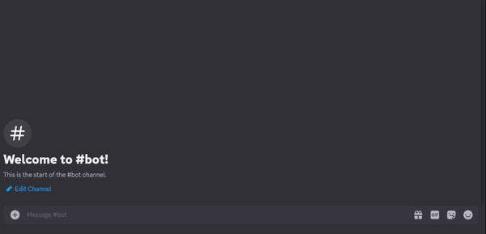

# OpenAI Bot UNSW-AI-SOC 

This repository contains a Discord bot written in Python that utilizes OpenAI's GPT (Generative Pre-trained Transformer) model to provide responses to user prompts. Below is an overview of the key components and functionalities of the bot.

### Common usage example:

### Multiple language support:

## Bot Commands

The bot responds to the following commands:

- `/hello`: Greets the user.
- `/fact`: Provides a random cool fact.
- `/promptsleft`: Shows how many prompts the user has left for the day.
- `/prompt <your prompt>`: Sends the user's prompt to the AI for a response. Usage is limited to 3 per day.

## Additional Notes

- The bot implements basic spam detection to prevent abuse.
- It tracks user messages and applies cooldowns to prevent excessive use of the `/prompt` command.
- The bot stores messages and user information in an SQLite database for analytics and moderation purposes.

For further assistance or inquiries, feel free to contact the repository maintainers.
